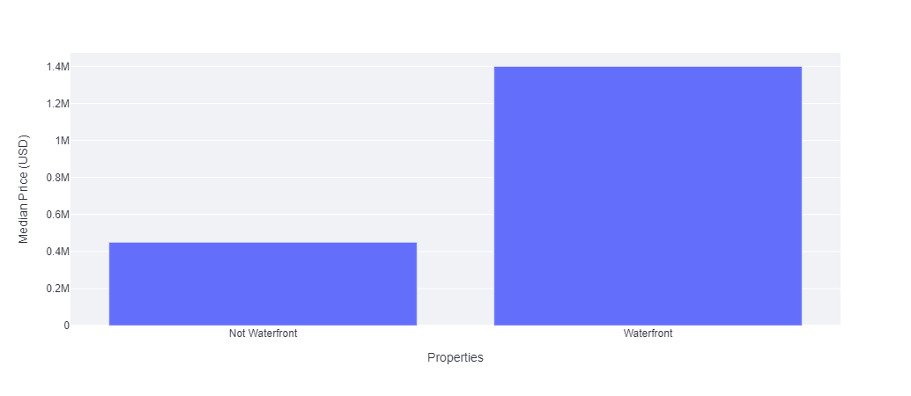
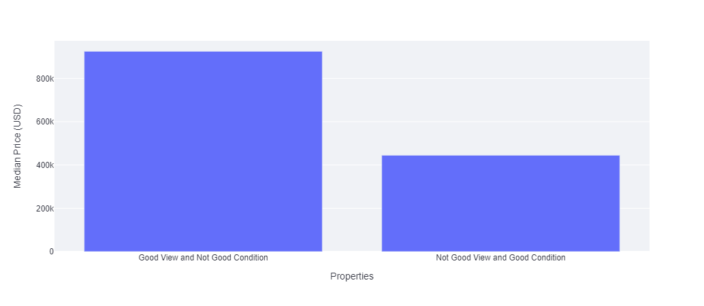
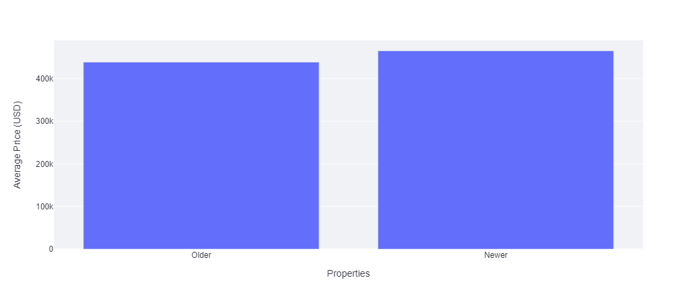
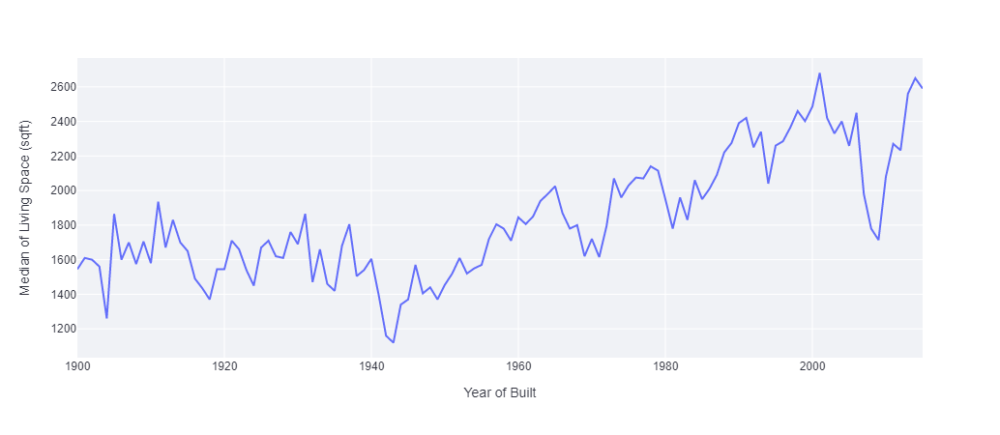
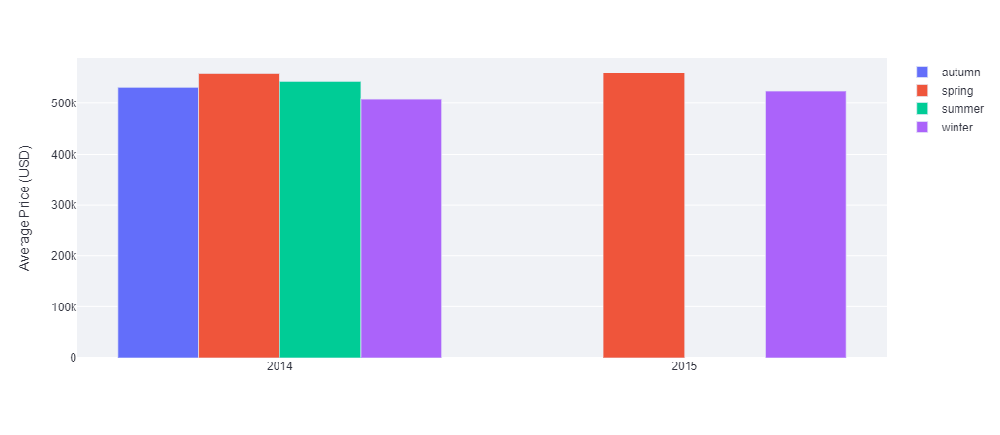

# King County Housing Market Insights 

This project aimed to provide a data-driven business solution to answer very common questions in the housing market through exploratory data analysis (EDA) -  which properties should the company buy and how long wait before selling them, and what would the selling price be?     

As part of the deliverables, an online dashboard was developed, with the properties available to be part of the company's portfolio having attribute filters, maps with the distribution of the properties, key statistics, the main insights from the exploratory analysis, and the expected profit of the properties suggested for purchase.

## Introduction
According to new research by [Zillow](https://www.zillow.com/research/us-housing-market-total-value-2021-30615/), the total value of every home in the U.S. is US$33.6 trillion, nearly as much as the GDP of the two largest global economies combined -- the U.S. and China.

Buying and selling properties is among the biggest commitments and a great source of income for companies and individuals. Sometimes buying a property  to sell means that the temporary owner has to make repairs or renovations to increase the value of the property, and hold the sale until it can sell for a higher price than what was paid. The goal is to buy low and sell high, investing your capital to cut costs and make a profit in a relatively short period - usually within months or a year.    

This challenge aimed to answer the following questions that may arise for any company or individual who wants to profit from buying and selling property - which properties should the company buy, how long wait before selling them, and what would the selling price be?

To answer the business questions, the House Sales in King County Dataset from [Kaggle](https://www.kaggle.com/datasets/harlfoxem/housesalesprediction) was investigated through exploratory data analysis (EDA). King County is located in the U.S. state of Washington. The population was 2,252,782 in the 2019 census estimate, making it the most populous county in Washington, and the 12th-most populous in the United States. The county seat is Seattle, also the state’s most populous city. This dataset has 21,597 listings from May 2014 to May 2015, with features covering the price, attractiveness, size, location, and comparison to 15 nearby homes.   

Main visualizations are available on an online [dashboard](https://analysis-king-county-housing.herokuapp.com/) made using Streamlit and hosted using Heroku. It can be accessed by anyone on mobile or desktop.

## Business Problem 
House Rocket business model consists of purchasing and reselling properties through a digital platform. The company is looking for new properties for its portfolio. The data scientist is in charge to help find the best business opportunities by answering the questions: 

1. Which properties should the company buy? 
2. Once the property is in the company's possession, how long wait before selling it, and what would ta the sale price be?

As a deliverable, the company would like an online dashboard, which in addition to containing the answers to the above questions, should contain:

3. A map view with properties available.    
5. A table view with attributes filters.      
7. Key statistics.     
9. Main Insights from the analysis.     

## Business Results
Based on commercial criteria, 8,130 properties are recommended to be purchased by House Rocket resulting in a **profit of 702,080,905.28 USD**, which represents **20.33% of the total investment**. This result already considering repairs or renovations expenses.

## Assumptions
* The data available is only from May 2014 to May 2015.
* Properties built from 1965 are labeled as 'newer' and before as 'older'.
* Prices depend on the region (zipcode).     
* Prices below the regional median may indicate potential businesses.
* Selling prices might adjust according to season of year.
* For propertie condition less than or equal to 2, no more than 12% of the house initial value will be spent in renovating it.
* For properties in a condition equal to 3, no more than 8% of the house initial value will be spent in renovating it.
* For properties in condition greater than or equal to 4, no more than 6% of the house initial value will be spent in renovating it.
* Properties with bedrooms disproportional with interior living squarefoot were deleted, assuming it was a input error.
* Properties with bathrooms less than 0.75 were considered commercial properties, and deleted.

 Definitions of the features in the original dataset.

| Feature       | Definition                                                                                                                                |
|:--------------|:------------------------------------------------------------------------------------------------------------------------------------------|
| id            | Unique ID for each property available.                                                                                                    |
| date          | Date that the property was available.                                                                                                     |       
| price         | Sale price of each property.                                                                                                              |
| bedrooms      | Number of bedrooms.                                                                                                                       |
| bathrooms     | Number of bathrooms. Where 0.5 accounts for a toilet, 0.75 for bathroom with shower or bathtub and 1 for bathroom with shower and bathtub.|
| sqft_living   | Square footage of the property interior living space.                                                                                     |
| sqft_lot      | Square footage of the land space.                                                                                                         |
| floors        | Number of floors.                                                                                                                         |
| waterfront    | A dummy variable for whether the property was overlooking the waterfront(1) or not (0).                                                   |
| view          | Means how good the view of the property is from 0 to 4.                                                                                   |
| condition     | Means how good the condition of the property is from 0 to 5.                                                                              |
| grade         | An level from 1 to 13 that represents construction and designer, where 1-3 falls short, 7 has a medium level, and 11-13 has a high level. |
| sqft_above    | The square footage of the interior property space that is above ground level.                                                             |
| sqft_basement | The square footage of the interior property space  that is below ground level.                                                            |
| yr_built      | The year that the construction of the property began.                                                                                     |
| yr_renovated  | The year of the property’s last renovation.                                                                                               |
| zipcode       | What zipcode area the property is in.                                                                                                     |
| lat           | Lattitude.                                                                                                                                |
| long          | Longitude.                                                                                                                                |
| sqft_living15 | The square footage of interior housing living space  for the nearest 15 neighbors.                                                        |
| sqft_lot15    | The square footage of the land lots of the nearest 15 neighbors .                                                                         |

 Definitions of the created features. 

| Feature                 | Definition                                                                    |
|:------------------------|:------------------------------------------------------------------------------|
| price_bins              | Variable for define if property price is under median or from median upward.  |
| season                  | Season fo year that property became available.                                |
| price_sqft              | Property price per square footage.                                            |
| newer                   | A dummy variable for whether the property built from 1965 (1) or not (0).     |
| basement                | A dummy variable for whether the property was basement (1) or not (0).        |
| renovated               | A dummy variable for whether the property have been renovated (1) or not (0). |
| median_price_zipcode    | Median price of zipcode regio.                                                |
| decision                | Whether a property should be bought.                                          |
| maximal_expend          | Suggested maximum spending on renovations and repairs.                        | 
| suggested_selling_price | Suggested selling price if the property should be bought.                     |
| expected_profit         | Difference between suggested selling price and total investment.              |

## Solution Strategy
1. Understand the business model and the business problem. 
2. Data collection – download the data from [Kaggle](https://www.kaggle.com/harlfoxem/housesalesprediction).
3. Data description and filtering  – check data types, missing values, duplicates, inconsistent values.
4. Draw hypotheses.
5. Feature engineering for analysis – `price_bins`, `season`, `price_sqft`, `newer`, `basement`, `renovated`.
6. Exploratory data analysis.
7. Insights conclusion and business decision.
8. Feature engineering for business decision – `median_price_zipcode`, `decision`, `maximal_expend`, `suggested_selling_price`, `expected_profit`.
9. Create the dashboard on Streamlit.
10. Deploy dashboard on [Heroku](https://analysis-king-county-housing.herokuapp.com/).

## Main Insights
**At the median, waterfront properties are 211.11% more expensive.**     
It was to be expected, considering the same region, that waterfront properties would cost more than without it. What was not expected was that the difference would be  so big. Having the chance to buy waterfront, property for a low price allows you to practice a higher profit margin.

**Business Action Suggestion:** A waterfront property, sold at a price lower than the regional median, should be purchased regardless of the condition.    

**At the median, properties with a good view that are not in good condition are 107.87% more expensive, than properties that do not have good view that are in good condition.**  
Having a good view makes the property much more expensive than its condition. Having the chance to buy a property with a good view, for a low price allows you to practice a higher profit margin, regardless of the propertie condition.

**Business Action Suggestion:** A property, which has a good view (from 3 upwards), being sold for a price lower than the regional median price, should be purchased if the if the condition is from 2 upwards.    

**On average, older properties are only 6.03% cheaper than newer.**
Older properties (built before 1965) were expected to cost at least 20% less than newer properties. Counterintuitively, as noted in the graph, older properties are, on median, only about 6% cheaper.

**Business Action Suggestion:** It is more appropriate to choose newer properties over older ones. The small price difference may not compensate for possible renovation expenses in the case of older properties. Therefore, when thinking about buying older properties, we should choose those in very good condition (from 4 upwards).    

**The living space of the properties increased over construction year timeline.**     
This shows that people nowadays have a preference for bigger properties. This preference reinforces the proposal to buy newer properties.

**Business Action Suggestion:** It is preferably to buy newer properties. They are generally larger, which people prefer, and typically, cost less to renovate newer properties.     

**It cannot be said that there is a better season to sell a property.**     
Prices are slightly higher in spring and summer, but when taking into account the relative deviation from one average price to another, we can not say that there is better season to sell a property, more data is needed.

**Business Action Suggestion:** It is preferably to buy newer properties. They are generally larger, which people prefer, and typically, cost less to renovate newer properties. With the above consideration, selling a property as quickly as possible is better for increasing working capital.

## Conclusion
It was possible to create indicators of suitable properties to maximize the company's profits. By making assumptions about the key features involved in the case, I outlined a solution plan that saved me time and gave me the right directions to seek answers.     

The main insights obtained from the exploratory data analysis reaffirmed some hypotheses and pointed to new ways of doing business, such as waterfront properties and properties with a good view. The solution created also provides an easy-to-use interactive online dashboard that can be accessed on mobile or desktop, which makes our solution accessible and shareable, facilitating decision-making.

As a main result, based on commercial criteria, 8,130 properties are recommended to be acquired by House Rocket resulting in a profit of 702,080,905.28 USD, which represents 20.33% of the total investment. This result already considering repairs or renovations expenses.

## Next Steps
* Expand this methodology to other regions that House Rocket operates.
* Creating a machine learning model to predict the price of a house according to its relevant features.
* Build a recommender system.

## References
Dataset House Sales in King County (USA) from [Kaggle](https://www.kaggle.com/harlfoxem/housesalesprediction).    
Variables Meaning on [Kaggle Discussion](https://www.kaggle.com/harlfoxem/housesalesprediction/discussion/207885).    
Python from Zero to DS on [Comunidade DS](https://www.comunidadedatascience.com).     
Seattle imagem by [Caleb Riston](https://unsplash.com/@calebriston) on [Unsplash](https://unsplash.com/).
